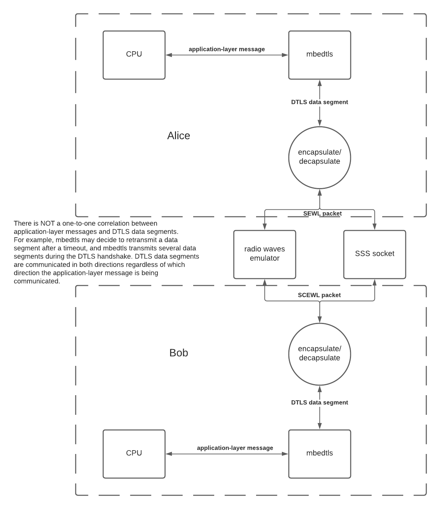

# DTLS-over-SCEWL (DoS)

This is the protocol that SCEWL controllers use for sending unicast messages to each other and for communicating with the SSS. The protocol consists of the Datagram Transport Layer Security (DTLS) protocol run on top of SCEWL. DTLS provides mutual authentication using X.509 certificates, data integrity and confidentiality, replay protection, forward secrecy, etc. DTLS is very similar to TLS; the difference is that DTLS is designed to run on top of datagram transport (such as UDP) rather than stream transport (such as TCP).

In the case of unicast messages to another SED, the DTLS data segments are encapsulated in SCEWL packets and then transmitted over the air. In the case of communication with the SSS, the DTLS data segments are encapsulated in SCEWL packets and then sent over the wire to the SSS. The SSS also encapsulates outgoing DTLS data segments in SCEWL packets before sending them over the wire to the SED.

We use the [Mbed TLS](https://github.com/ARMmbed/mbedtls) library for our DTLS implementation. Mbed TLS is [maintained by ARM](https://tls.mbed.org/) and well-supported. Mbed TLS does all of the handling of the DTLS handshake and encapsulating application-layer data into DTLS. In our code, we handle shuttling DTLS data segments from Mbed TLS on one SED/SSS to Mbed TLS on another SED/SSS; we accomplish this by sending them over SCEWL as previously stated. With that in place, we can then just give Mbed TLS any plaintext application-layer data we want to send and the same plaintext will automagically arrive at the output of Mbed TLS on the destination SED.

Mbed TLS is also used in the SSS. The SSS code is written in Python but we use the [`python-mbedtls`](https://pypi.org/project/python-mbedtls/) package, which provides an interface between our Python code and the Mbed TLS library using [Cython](https://cython.org/).

The below data flow diagram shows how our unicast and SSS messaging works.

## Mutual authentication

The SCEWL controllers and the SSS perform mutual authentication for all DTLS sessions. In order to do this, each node needs its own certificate and keypair and a CA certificate to use for validating the peer's certificate.

### Provisioning certificates

Each SCEWL controller has a CA certificate, its own certificate, and its own keypair hardcoded into it during provisioning. These are hereafter referred to as the 'provisioning certificates'. The provisioning certificates are used for all communications with the SSS. When an SED is not registered, it will also use its provisioning certificates for DTLS sessions with other SEDs.

### Runtime certificates

During registration, the SSS generates a new keypair and certificate and sends them to the SED along with a CA certificate. These are hereafter referred to as the 'runtime certificates'. The runtime CA certificate is different than the provisioning CA certificate. After the SED has registered and received the runtime certificates, it uses those for communications with other SEDS. The next time that the SED wants to communicate with the SSS, it discards the runtime certificates and resumes using the provisioning certificates.

### SSS

The SSS uses the provisioning CA certificate as its own certificate for DTLS.

## Mbed TLS configuration

We tuned our Mbed TLS configuration for better security. Because we control all endpoints, we can disable less-secure TLS features in favor of using the most secure ones. Check out our [configuration file](../controller/mbedtls-config.h).

Mbed TLS requires dynamic memory allocation. We initially considered using an RTOS to provide this facility, but we did not have the man-hours available to implement that. Fortunately, Mbed TLS can [bring its own dynamic memory allocator](https://tls.mbed.org/kb/how-to/using-static-memory-instead-of-the-heap). We chose to use that option. Notably, the allocator provided by Mbed TLS has no heap smashing protection.

## Custom changes to Mbed TLS

`/controller/mbedtls/` is a git submodule for the Mbed TLS library. `/controller/mbedtls_custom/` contains modified versions of some files from the Mbed TLS library. The files that we have modified are `aes.c`, `hmac_drbg.c`, and the corresponding header files. Please see [this file](mbedtls_changelog.md) for a list of the modifications we made.

## Usage

On startup and before entering the main loop, the `main` function in `controller.c` calls `dtls_setup`, which initializes the DTLS subsystem. In the event that the DTLS subsystem experiences an unrecoverable error at any time, `dtls_fatal_error` is called, which prints information about the error and then calls `dtls_teardown`. `dtls_teardown` frees all of the memory that was allocated by `dtls_setup`.

In order to send a message, `main` calls `dtls_send_message` or `dtls_send_message_to_sss`, depending on whether the message should be sent over the air or to the SSS. When a unicast packet is received over the air or a packet is received over the SSS interface, the packet is passed by `main` to `dtls_handle_packet`.

When the DTLS subsystem has finished a transaction with the SSS, it passes the received response to `handle_sss_recv` in `controller.c`. When the DTLS subsystem has finished receiving a message over the air, it passes the received message to `handle_scewl_recv` in `scewl.c`.

When a timeout has expired, `main` calls `dtls_check_timers`.
